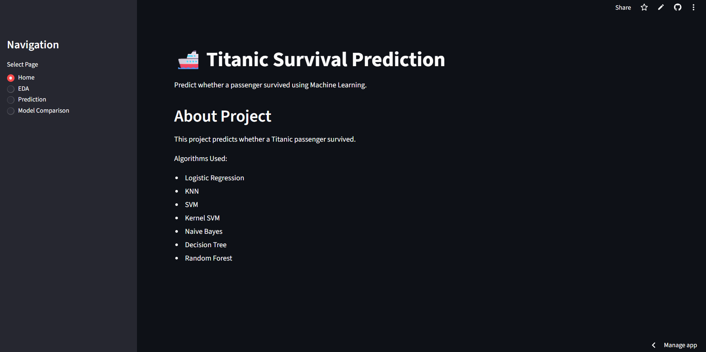
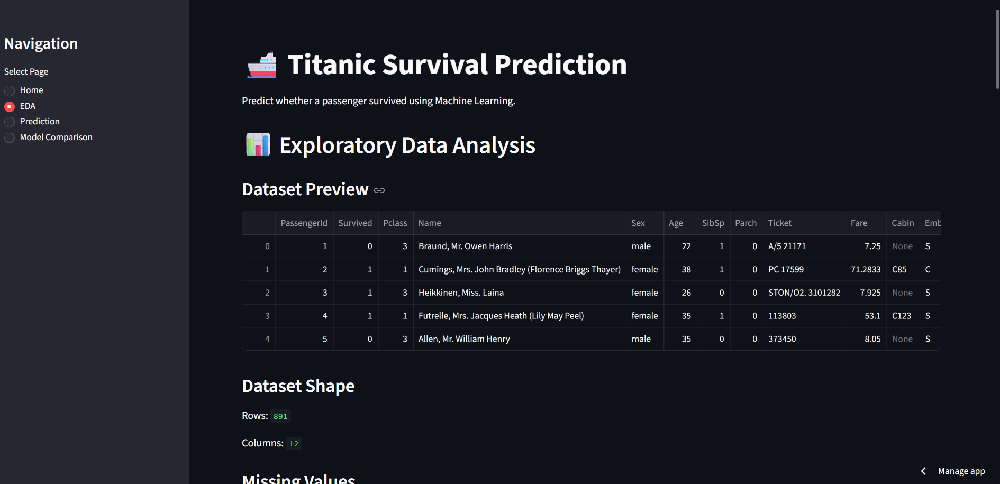
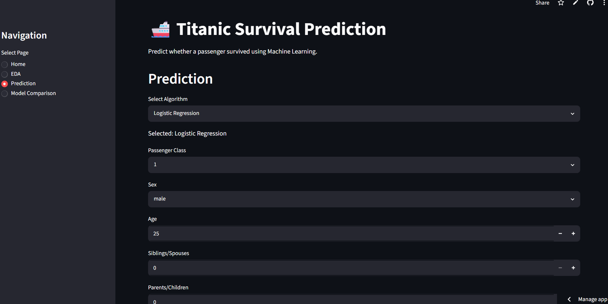
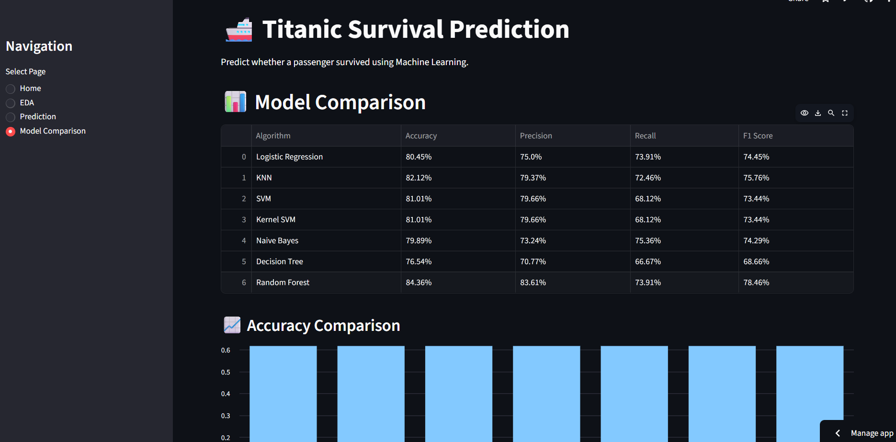

# 🚢 Titanic Survival Prediction using Machine Learning

A Machine Learning web application built with **Streamlit** that predicts whether a passenger would survive the Titanic disaster. The project compares seven classification algorithms and allows users to select an algorithm for prediction through an interactive web interface.

---

## 🌐 Live Demo

https://titanic-survival-prediction-using-machine-learning-qrub2xwxqcw.streamlit.app/

## 📂 GitHub Repository

https://github.com/Jyoti-246/Titanic-Survival-Prediction-using-Machine-Learning

---

## 📸 Application Screenshots

### 🏠 Home Page



### 📊 EDA Page



### 🔮 Prediction Page



### 📈 Model Comparison



...

## 📌 Project Overview

This project uses the Titanic dataset to predict passenger survival based on features such as:

- Passenger Class
- Gender
- Age
- Fare
- Number of Siblings/Spouses
- Number of Parents/Children
- Embarkation Port

### The application includes:

- 📊 Exploratory Data Analysis (EDA)
- 🧹 Data Preprocessing
- 🤖 Model Training
- 📈 Model Comparison
- 🔮 Interactive Prediction using Streamlit

---

## 📂 Dataset

**Dataset:** Titanic - Machine Learning from Disaster

Source:
https://www.kaggle.com/competitions/titanic

---

## 🚀 Features

- Interactive Streamlit Web App
- Exploratory Data Analysis (EDA)
- Missing Value Handling
- One-Hot Encoding
- Feature Scaling
- Seven Classification Algorithms
- Model Performance Comparison
- Passenger Survival Prediction

---

## 🛠️ Technologies Used

- Python
- Streamlit
- Pandas
- NumPy
- Scikit-learn
- Joblib

---

## 🤖 Machine Learning Algorithms

- Logistic Regression
- K-Nearest Neighbors (KNN)
- Support Vector Machine (SVM)
- Kernel SVM
- Naive Bayes
- Decision Tree
- Random Forest

---

## 📊 Model Performance

| Algorithm           |   Accuracy |  Precision |     Recall |   F1 Score |
| ------------------- | ---------: | ---------: | ---------: | ---------: |
| Logistic Regression |     80.45% |     75.00% |     73.91% |     74.45% |
| KNN                 |     82.12% |     79.37% |     72.46% |     75.76% |
| SVM                 |     81.01% |     79.66% |     68.12% |     73.44% |
| Kernel SVM          |     81.01% |     79.66% |     68.12% |     73.44% |
| Naive Bayes         |     79.89% |     73.24% |     75.36% |     74.29% |
| Decision Tree       |     76.54% |     70.77% |     66.67% |     68.66% |
| **Random Forest**   | **84.36%** | **83.61%** | **73.91%** | **78.46%** |

🏆 **Best Model:** Random Forest

---

## 📈 Exploratory Data Analysis

The application includes:

- Dataset Preview
- Missing Value Analysis
- Survival Distribution
- Survival by Gender
- Survival by Passenger Class
- Age Distribution
- Fare Distribution

---

## 📁 Project Structure

```text
Titanic-Survival-Prediction/
│
├── app.py
├── requirements.txt
├── README.md
│
├── dataset/
│   └── train.csv
│
├── models/
│   ├── encoder.pkl
│   ├── scaler.pkl
│   ├── logistic_regression.pkl
│   ├── knn.pkl
│   ├── svm.pkl
│   ├── kernel_svm.pkl
│   ├── naive_bayes.pkl
│   ├── Decision_tree_classification.pkl
│   └── random_forest.pkl
│
└── notebooks/
    ├── Logistic Regression.ipynb
    ├── KNN.ipynb
    ├── SVM.ipynb
    ├── Kernel SVM.ipynb
    ├── Naive Bayes.ipynb
    ├── Decision Tree.ipynb
    └── Random Forest.ipynb
```

---

## ⚙️ Installation

### Clone the repository

```bash
git clone https://github.com/Jyoti-246/Titanic-Survival-Prediction-using-Machine-Learning.git
```

### Navigate to the project

```bash
cd Titanic-Survival-Prediction-using-Machine-Learning
```

### Install dependencies

```bash
pip install -r requirements.txt
```

### Run the application

```bash
streamlit run app.py
```

---

## 🎯 Future Improvements

- Hyperparameter Tuning
- Cross Validation
- ROC Curve Comparison
- Feature Importance Visualization
- Scikit-learn Pipeline
- Cloud Deployment

---

## 👩‍💻 Author

**Jyoti Kedia**

BCA Student | Machine Learning & Full Stack Development Enthusiast

---

⭐ If you found this project useful, consider giving it a star!
